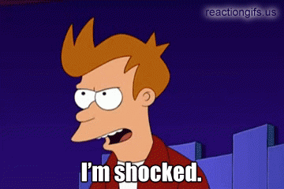
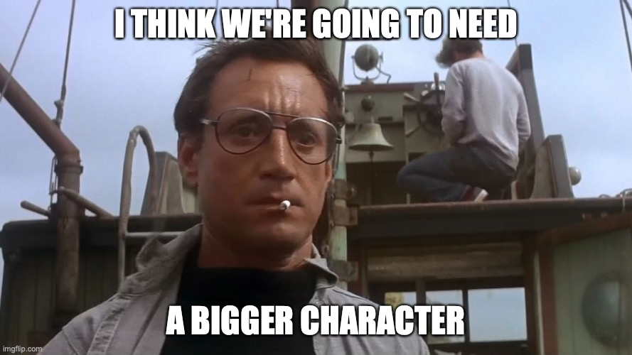

# Strings and OsStr: A wild ride through the history of Unicode 

#### Jonathan Pallant

---

# A Journey...

1. A String is just a String, right?
1. A Brief History of the String
1. Not all Strings are alike

---

# A String is just a String, right?

* String
* Byte String
* OS String
* C Strings

---

## String

```rust
let s: String = "Hi 😀!".to_owned();
dbg!(&s);
dbg!(s.len());
dbg!(s.bytes().count());
dbg!(s.chars().count());
```

[▶️](https://play.rust-lang.org/?version=stable&mode=debug&edition=2021&gist=dc9bead8ea15ce3bc95fb4b87fbcc963)

* A Vector of `u8` inside
* Iterates as 32-bit `char`

---

## Byte String

```rust
let s: [u8; 13] = b"Hello, world!".to_owned();
dbg!(&s);
dbg!(s.len());
```

[▶️](https://play.rust-lang.org/?version=stable&mode=debug&edition=2021&gist=27b67623710f3e5125163db204ff709d)

* Iterates as octets (`u8`)
* A Vector of octets (`u8`) inside

---

# A Brief History of the String

---

## The Punched Card


<!-- Contains the EBCDIC character set -->

---

## Character Encoding

* Computers work in numbers
* Humans like to write words
* Words are made of characters
	* Technically grapheme clusters
	* Is ï one character or two?
* We need a conversion table!
	* AKA: A Character Set

---

## American Standard Code for Information Interchange

* Morse Code
* Telegraph / Baudot codes
* BCD
* EBCDIC
* ASA X3.4-1963 
* aka ASCII

<!-- X3 committee of the American Standards Association -->

---

## An ASCII Table


<!-- Let's encode H e l l o -->

<!-- Now let's encode t s c h ü s s -->

---



---

## What if we used the eighth-bit?

* We get 128 more characters!


---

## More standards are required...

* MS-DOS Code Page 437, 850, ...
* Windows Code Page 1252, 1250, ...
* Macintosh Code Page 1275, 1282, ...

---

## OK, one Standard to Rule Them All then

> Unicode is intended to address the need for a workable, reliable world text encoding. Unicode could be roughly described as "wide-body ASCII" that has been stretched to 16 bits to encompass the characters of all the world's living languages. In a properly engineered design, 16 bits per character are more than sufficient for this purpose.

---

## OK, let's go!

* Microsoft used it in Windows
* Sun used it in Java
* Netscape used it in JavaScript
* The Standard C Library added `wcslen` and friends

---

## Unicode 2.0 in 1996...



* Unicode Translation Format 16 (UTF-16) arrives

---

## Isn't this the *worst* of everything?

* Unit length != number of characters
* Not ASCII compatible
* Enter Plan 9 and UTF-8...

---

## UTF-8

* Variable-length encoding
* Can encode any Unicode Scalar Value as one, two, three or four bytes.
* Unit length != number of characters
* `0b0xxxxxxx`
* `0b110xxxxx 0b10xxxxxx`
* `0b1110xxxx 0b10xxxxxx 0b10xxxxxx`

<!-- order matters! Not all 8-bit sequences are valid UTF-8 -->

---

## Are we done now?

* POSIX says file names are an array of 8-bit values
* Windows says file names are an array of 16-bit `wchar_t`
* :(

---

# Not all Strings are alike

* `String`/`&[str]`/`"hi"`
	* use this by default
* `Vec<u8>`/`&[u8]`/`b"hi"`
	* use for exchanging data with 8-bit / ASCII systems
* `OsString`/`OsStr`
	* use for exchanging data with your Operating System

---

## C Strings?

* `CString`/`CStr`
	* use for exchanging data with 8-bit C APIs
	* null-terminated
	* Might not be UTF-8
* https://docs.rs/widestring/
	* use for exchanging data with 'wide' C APIs

---

# <!-- fit --> Questions?


  